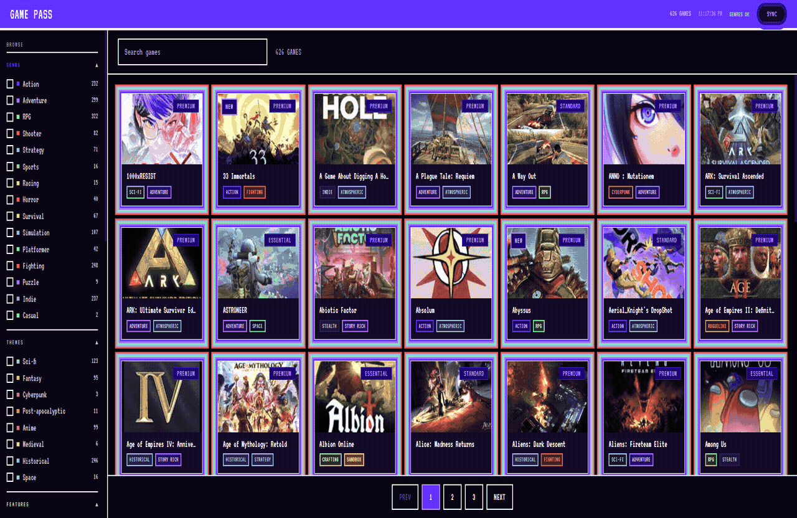
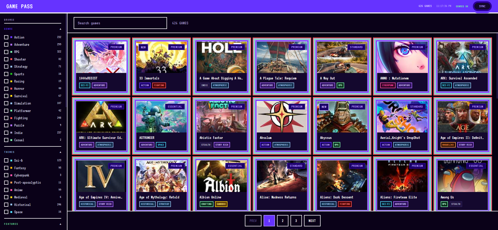
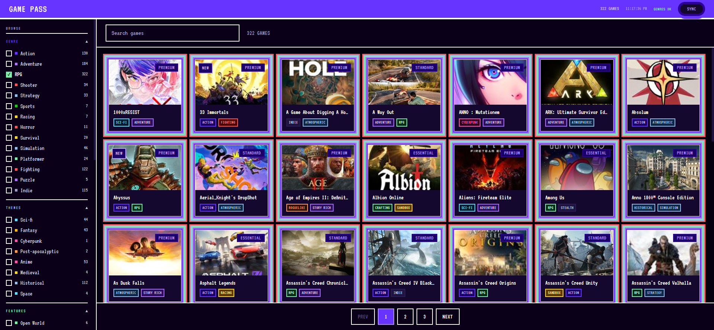
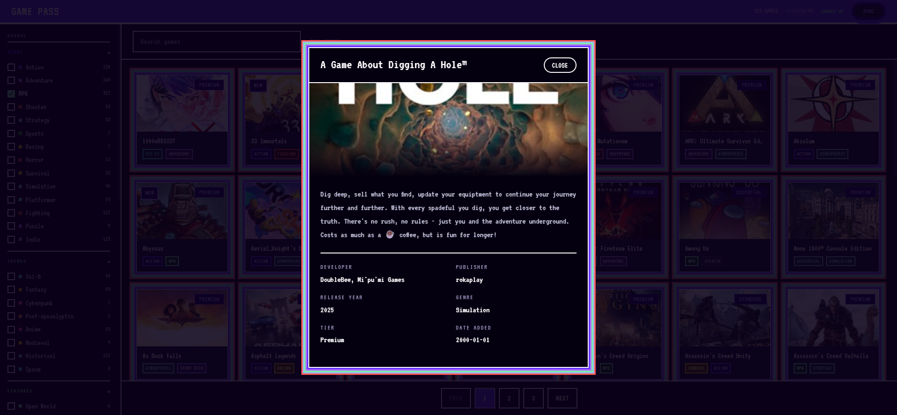

# Game Pass Search

A local desktop app for browsing, filtering, and exploring the full Xbox Game Pass catalog. Syncs directly from Microsoft's catalog API, stores everything in a local SQLite database, and runs an on-device AI model to classify games into genres and tags.

<p align="center">
  
</p>

---

## Features

**Live catalog sync**
Pulls the full Game Pass library from Microsoft's official catalog on launch. Correctly reflects tiers (Essential, Standard, Premium), recently added titles, and games that are leaving soon.

**On-device genre classification**
Downloads two small AI models the first time you run Enrich Genres (~110 MB total, cached permanently). Classification runs entirely on your machine. No cloud, no API keys, no data sent anywhere.

**Steam-style tag filters with include and exclude**
Click once to include a tag (green), click again to exclude it (red), click a third time to clear. Every count in the sidebar updates to reflect your current selection. You can combine includes and excludes freely across categories.

**Four tag categories**
Genre, Themes, Features, and Mood. Tags like Open World, Roguelike, Cyberpunk, Story Rich, and Atmospheric sit alongside the standard genre labels.

**Drilldown filtering**
When a filter is active, every count in the sidebar shows how many games match that tag within your current selection. Narrowing down works the same way faceted search works on large e-commerce sites.

**Persistent image cache**
Thumbnails are fetched at display size once, then served from disk. Repeat visits are instant.

**Game detail modal**
Full description, developer, publisher, release year, genre tags, platform availability, and tier in one overlay. Press Escape or click the backdrop to close.

---

## Screenshots

| Browse | Filtered by RPG | Game detail |
|---|---|---|
|  |  |  |

---

## Tech Stack

| Layer | Technology |
|---|---|
| Desktop shell | Electron 30 |
| Frontend | React 18 + Vite 5 |
| API server | Express (in Electron main process) |
| Database | SQLite via better-sqlite3 |
| Image cache | Disk-based, served through Express |
| Genre classification | Transformers.js (Xenova/nli-deberta-v3-small, local ONNX) |
| Sentence embeddings | Transformers.js (Xenova/all-MiniLM-L6-v2, local ONNX) |
| Data source | Microsoft Game Pass catalog API |

---

## Getting Started

### Requirements

- Node.js 18 or later
- Windows (primary target, macOS untested)

### Install and Run

```bash
git clone https://github.com/your-username/gamepass-search
cd gamepass-search
npm install --ignore-scripts
npm run rebuild
npm run dev
```

The `--ignore-scripts` flag is needed because `better-sqlite3` requires recompilation for Electron's bundled Node version. The `rebuild` script handles that step.

### First Run

The app syncs the Game Pass catalog automatically when it starts. Once the window is open, click **Enrich Genres** in the header bar to run the local AI classification. The two models download once and cache permanently at `~/.cache/gamepass-search/`. Classification runs in a background worker thread so the app stays responsive throughout.

---

## Filters

| Filter | How it works |
|---|---|
| Genre, Themes, Features, Mood | AI-classified tags. Click to include (green), click again to exclude (red). |
| Tier | Essential, Standard, or Premium. Same include/exclude behavior. |
| Platform | Console, PC, Cloud. |
| Multiplayer | Solo, Co-op, Online Multiplayer. |
| Release Year | Min/max year range. |
| Metacritic | Min/max score range. |
| New (last 30 days) | Games on Microsoft's official recently-added list. |
| Leaving soon | Games on Microsoft's official leaving list, with approximate removal date. |

---

## Development

```bash
npm run dev        # Start with Vite hot reload
npm test           # Run test suite (52 tests)
npm run rebuild    # Recompile native modules after a Node version change
```

Press **Ctrl+R** inside the Electron window to reload the renderer without restarting the backend. Press **Ctrl+Shift+I** to open developer tools.

---

## Project Structure

```
├── electron/          Electron main process, window setup, server startup
├── server/
│   ├── db.js          SQLite schema and singleton
│   ├── sync.js        Microsoft catalog API fetch and upsert
│   ├── enrich.js      Worker thread coordinator for AI classification
│   ├── enrichWorker.mjs  ONNX inference (genre tags + embeddings)
│   ├── imageCache.js  Disk-based image proxy
│   └── routes/        Express route handlers
└── src/
    ├── components/    React components (Header, FilterSidebar, GameCard, etc.)
    └── hooks/         useFilters, useGames
```

---

## License

MIT
